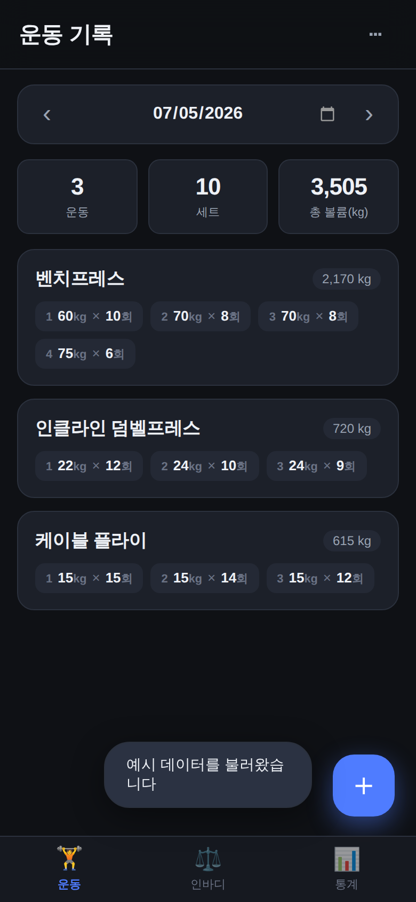
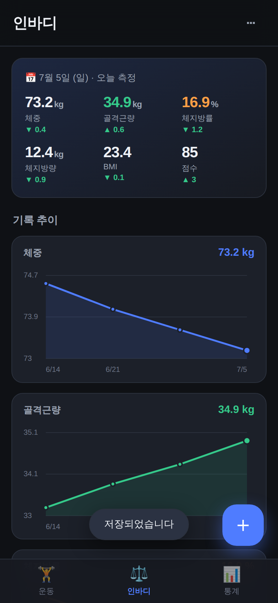
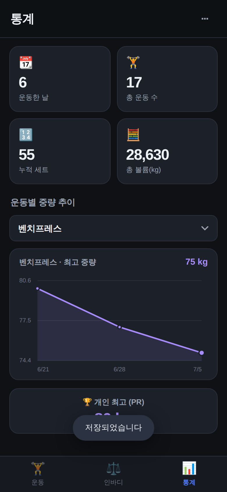

# 핏로그 (FitLog) · 웨이트 트레이닝 기록 앱

운동별 **중량 · 세트수 · 세트당 반복 횟수**와 **인바디 측정 결과**를 기록하는 모바일 웹앱(PWA)입니다.
설치형(홈 화면 추가) · 오프라인 동작 · 모든 데이터는 **내 기기에만** 저장됩니다(서버 전송 없음).

<p align="center">
  
  
  
</p>

## 주요 기능

### 🏋️ 운동 기록
- 날짜별로 운동을 기록 (◀ ▶ 로 날짜 이동, 달력에서 직접 선택)
- 운동별로 **세트마다 중량(kg) × 반복(회)** 입력 — 세트는 자유롭게 추가/삭제
- 운동 이름 **자동완성 + 빠른 선택 칩** (자주 하는 운동 기억)
- 운동/세트/총 볼륨(중량×반복 합계) 일일 요약
- 카드를 탭하면 편집·삭제
- 메모 기록 (컨디션, 자세 등)

### ⚖️ 인바디 기록
- 체중 · 골격근량 · 체지방량 · 체지방률 · BMI · 인바디 점수 기록
- 최신 측정값 카드 + **직전 대비 증감**(좋아진 방향은 초록, 나빠진 방향은 빨강)
- 체중 / 골격근량 / 체지방률 **추이 그래프**
- 전체 측정 이력 리스트 (탭하면 편집·삭제)

### 📊 통계
- 운동한 날 · 총 운동 수 · 누적 세트 · 총 볼륨 요약
- 운동을 선택해 **최고 중량 추이 그래프**와 **개인 최고 기록(PR)** 확인

### 💾 데이터 관리 (우측 상단 ⋯ 메뉴)
- **내보내기**: JSON 백업 파일로 저장 (기기 변경·앱 삭제 전 백업 권장)
- **가져오기**: 백업 파일로 복원
- **예시 데이터**: 앱을 둘러볼 수 있는 샘플 채우기
- **전체 삭제**: 모든 기록 초기화

## 실행 방법

빌드 도구·서버 없이 정적 파일만으로 동작합니다.

```bash
# 저장소 폴더에서 간단한 정적 서버 실행 (아무 방법이나 가능)
python3 -m http.server 8000
```

브라우저에서 `http://localhost:8000` 접속.

### 폰에 설치하기 (PWA)
1. 위 주소(또는 배포된 https 주소)를 **모바일 브라우저**로 엽니다.
2. 브라우저 메뉴에서 **"홈 화면에 추가"** 를 선택합니다.
3. 홈 화면 아이콘으로 실행하면 주소창 없는 앱처럼 전체화면으로 동작하고, 오프라인에서도 열립니다.

> 서비스워커 오프라인 캐시와 카메라/설치 기능은 `https` 또는 `localhost`에서 동작합니다.
> (`file://` 로 열어도 기록 기능 자체는 정상 동작합니다.)

## 기술 구성

순수 HTML/CSS/JavaScript. 외부 라이브러리·CDN 의존성 없음(완전 오프라인).

| 파일 | 역할 |
|------|------|
| `index.html` | 화면 구조 (운동·인바디·통계 탭, 입력 시트) |
| `css/style.css` | 다크 테마 모바일 UI |
| `js/store.js` | localStorage 데이터 계층 (CRUD·통계·백업/복원) |
| `js/charts.js` | 의존성 없는 SVG 라인 차트 렌더러 |
| `js/app.js` | 화면 제어·이벤트 처리 |
| `sw.js` | 오프라인 캐시 서비스워커 |
| `manifest.webmanifest` | PWA 설치 메타데이터 |
| `icons/` | 앱 아이콘 (192/512, maskable) |

## 데이터 보관 안내
- 모든 기록은 브라우저의 `localStorage`(이 기기)에 저장됩니다.
- 브라우저 데이터 삭제, 앱 제거, 기기 변경 시 사라질 수 있으니 **주기적으로 내보내기(백업)** 하세요.
